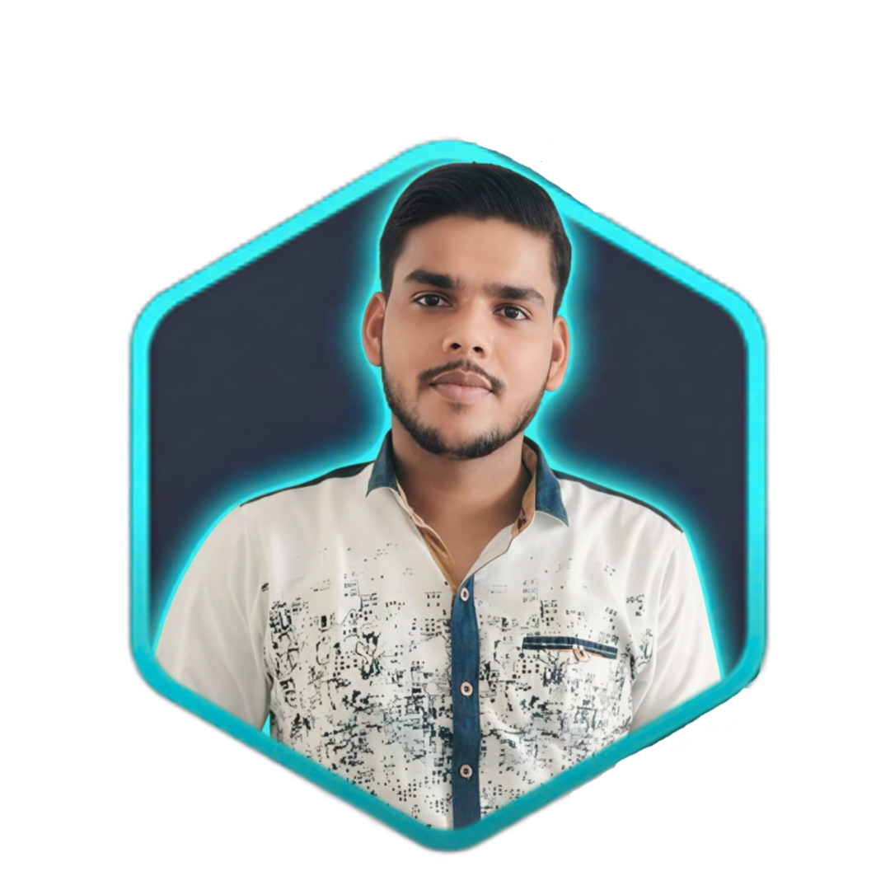

# 🤖 Meet Mukul — Interactive Developer AI Portfolio

> **"Don't browse my portfolio. Talk to it."**

An interactive, futuristic AI-powered developer portfolio built for **Mukul Kumar** (Full Stack MERN Developer & B.Tech Information Technology Student). Instead of static resume text, recruiters and engineering managers can converse with Mukul's digital twin, inspect live system architecture flows, launch Recruiter Mode candidate briefs, and navigate with a keyboard command palette.



---

## 🔥 Key Features

- **🤖 Interactive AI Assistant (Voice + Text)**: Instant recruiter query solver backed by a zero-latency structured local knowledge engine with optional Gemini 1.5 API integration and Web Speech API voice synthesis.
- **💼 Recruiter Candidate Brief**: Single-click Recruiter Mode with role filtering (*Frontend*, *Full Stack*, *Internship*, *Full-Time*), role fit score (`96%`), and one-click summary export for hiring teams.
- **⚡ Command Palette (`Ctrl + K` / `Cmd + K`)**: Vercel/Linear style keyboard shortcut navigation for instant jumping between sections and modals.
- **🛠️ Featured MERN Projects**:
  - **TeamZen**: Teammate finding portal for B.Tech students (React, Node.js, Express, MongoDB, Socket.io).
  - **Campus Split**: Hostel & campus expense splitting app with debt calculation algorithms.
  - **Resume Generator**: Dynamic ATS-friendly builder with server-side PDF compilation.
  - **Streak Aura**: Daily habit & activity streak tracker with GitHub contribution heatmaps.
- **🧬 Interactive System Architecture Visualizer**: Clickable layer-by-layer request flow inspector inside project deep-dive modals.
- **📊 Live Developer Dashboard**: Real-time status indicators (Building, Learning, DSA) and live GitHub API metrics stream.
- **📱 App-Like Mobile Navigation**: Floating bottom dock for seamless mobile user experience.

---

## 🛠️ Tech Stack

- **Frontend**: React 18, ES6+ JavaScript, Tailwind CSS v4, Framer Motion, Lucide Icons, Canvas Confetti
- **Backend**: Node.js, Express.js, RESTful APIs, WebSockets (Socket.io)
- **Database**: MongoDB Atlas, Mongoose ORM
- **Build Tool**: Vite
- **Speech & AI**: Web Speech API (Speech Recognition & Speech Synthesis), Gemini API

---

## 🚀 Quick Start & Local Setup

### 1. Clone the repository
```bash
git clone https://github.com/mukul953kumar/Ai-portfolio-mukul.git
cd Ai-portfolio-mukul
```

### 2. Install dependencies
```bash
npm install
```

### 3. Start development server
```bash
npm run dev
```
Open [http://localhost:5173](http://localhost:5173) in your browser.

---

## 📬 Contact & Connect

- **Email**: mukulkumar.dev@gmail.com
- **LinkedIn**: [linkedin.com/in/mukul-kumar](https://linkedin.com/in/mukul-kumar)
- **GitHub**: [github.com/mukul-kumar](https://github.com/mukul-kumar)

---

*Made with ❤️ by Mukul Kumar*
